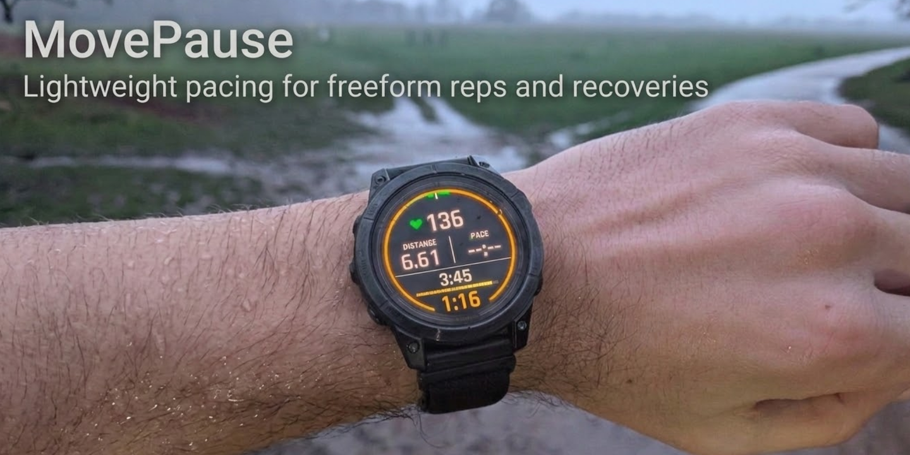

# MovePause

MovePause is a Garmin Connect IQ data field for unstructured intervals and recoveries.

It is built for runners who want rhythm and context during freeform sessions without setting up a workout in advance. While running, MovePause shows the current rep and progress against the previous running rep. While paused, it switches focus to the current recovery, keeps the previous running duration in view, and provides a simple 30-second haptic cue to help you know when it is time to go again.

## What It Does

MovePause is intentionally narrow:

* uses Garmin's timer state as the source of truth for running versus paused time
* treats the session as alternating running reps and recoveries rather than workout steps
* shows the current running rep as the primary number while moving
* shows the current recovery as the primary number while paused
* keeps the previous running duration as the secondary reference in both states
* compares each running rep against the previous running rep
* compares each recovery against the previous recovery
* provides a 30-second haptic pacing cue while paused
* alerts when the current rep or recovery reaches the previous comparable duration
* has no settings, no preset recovery target, and no preconfigured workout logic

## Why It Exists

Garmin handles structured workouts well, but many sessions are improvised:

* fartlek by feel
* hill reps until form fades
* standing recoveries between efforts
* stop-start urban running
* trail sessions shaped by terrain rather than a workout file

During those runs, the useful questions are usually simple:

* how long has this rep lasted
* how long has this recovery lasted
* how long did the previous rep take
* is this rep or recovery roughly in line with the last one

MovePause is meant to answer those questions quickly, without turning a freeform session into a setup task.

## What It Is Not

MovePause is not trying to be:

* a replacement for Garmin structured workouts
* a configurable interval timer
* a coaching system
* an analytics dashboard
* a custom activity app
* a cloud-connected training service

## Project Status

MovePause `v0.1` has been submitted to Garmin for approval. Core timer-state handling, rep and recovery comparison, and pacing alerts are implemented, and the supported device list is already defined in [manifest.xml](manifest.xml). Current work is focused on review follow-up, validation on the chosen devices, and incremental improvements.

## Repo Guide

* [Technical design notes](docs/TECHNICAL.md) describe the current behavioural model, UI priorities, and implementation details.
* [Roadmap](docs/ROADMAP.md) describes the delivery phases, launch criteria, and post-v1 ideas.
* [Connect IQ product page](connectiq/PRODUCT.md) contains the current store-facing copy and submitted assets.
* [Contributing](CONTRIBUTING.md) explains what kinds of feedback and contributions are useful at this stage.

## Contributing Now

Useful contributions right now include:

* device-specific observations about Garmin timer and Auto Pause behaviour
* feedback on pacing cues and glanceability during real sessions
* documentation fixes and clarity improvements
* implementation suggestions that keep the product simple and trustworthy

If you open an issue, use the repository templates where possible so device model, firmware, and reproduction details are captured consistently.

## License

This project is released under the MIT License. See [LICENSE](LICENSE).
