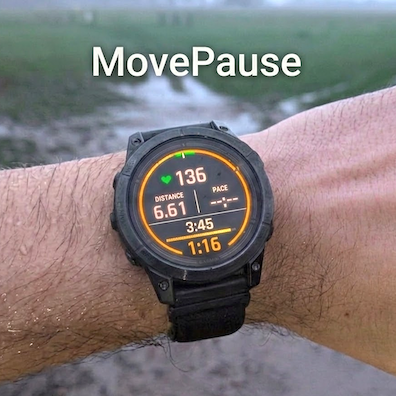

# MovePause

This page records the current Connect IQ Store copy and assets for MovePause.

## Description

MovePause is a Garmin data field for unstructured intervals and recoveries.

When you are running, it shows the current rep and a progress bar against the previous running rep. When you pause, it switches focus to recovery time, keeps the previous running duration in view, and compares the current recovery against the previous recovery.

A simple haptic cue every 30 seconds during recovery helps you stay in rhythm without watching the screen constantly.

There are no settings, no preset recovery timer, and no prebuilt workout steps. MovePause learns from the session itself: each running rep is compared with the previous running rep, and each recovery is compared with the previous recovery.

It is designed for runners doing fartlek, hill reps, improvised intervals, or any session that changes on the move. If you want pacing and context without building a workout in advance, MovePause keeps the essentials in view.

## What's New

Version `0.1`

First public release of MovePause.

This version introduces a lightweight data field for freeform reps and recoveries:

* current running rep and current recovery timing
* progress bars against the previous comparable rep or recovery
* previous running duration kept visible as the main contextual reference
* 30-second recovery haptic pacing
* no settings and no workout setup required

## Submitted Assets

* cover image: `assets/cover.png`
* hero image: `assets/hero.png`
* moving-state screenshot: `assets/moving.png`
* paused-state screenshot: `assets/paused.png`
